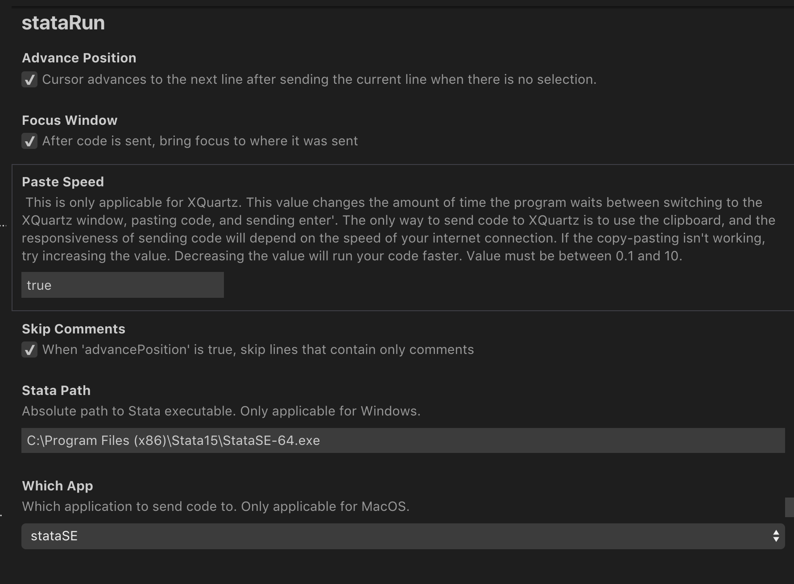

# Description

stataRun allow you to run  stata codes (.do .ado ) and commands from within Visual Studio Code editor. Thus you can take  advantage of an editor for syntax highlighting. You may want to install [Stata-Enhanced](https://marketplace.visualstudio.com/items?itemName=kylebarron.stata-enhanced) and [Stata-Language](https://marketplace.visualstudio.com/items?itemName=mdob2k.stata-language) for syntax highlighting and other features

## Features

The following command and keyboard shortcut are implemented (crtl to be replace by cmd on MacOS)
- shift+ctrl+a: Run All Lines ==> This will run the entire file
- shift+ctrl+s: Run Selection ==> To run a given slection. If no selection is made it default to Run All
- shift+ctrl+c: Run Current Line ==> This will run the current line code
- shift+ctrl+d: Run Downward  Lines==> from current line to downward
- shift+ctrl+f: Run Frontward Lines ==> from first line till current line

## Requirements

Settings derived from [stata-exec](https://github.com/kylebarron/stata-exec), which provide the same features for Atom.

## Known Issues

Only tested with Mac Os so far. Please and try create issues if any. Feel free to contributes.

## Installation

Install as a normal vscode extension by searcing for stataRun in the vscode extension marketplace
## Release
1.1.5
  - Fix bug that load the same file over and over
  - Add "stataRun" to each command in the to avoid confusion
